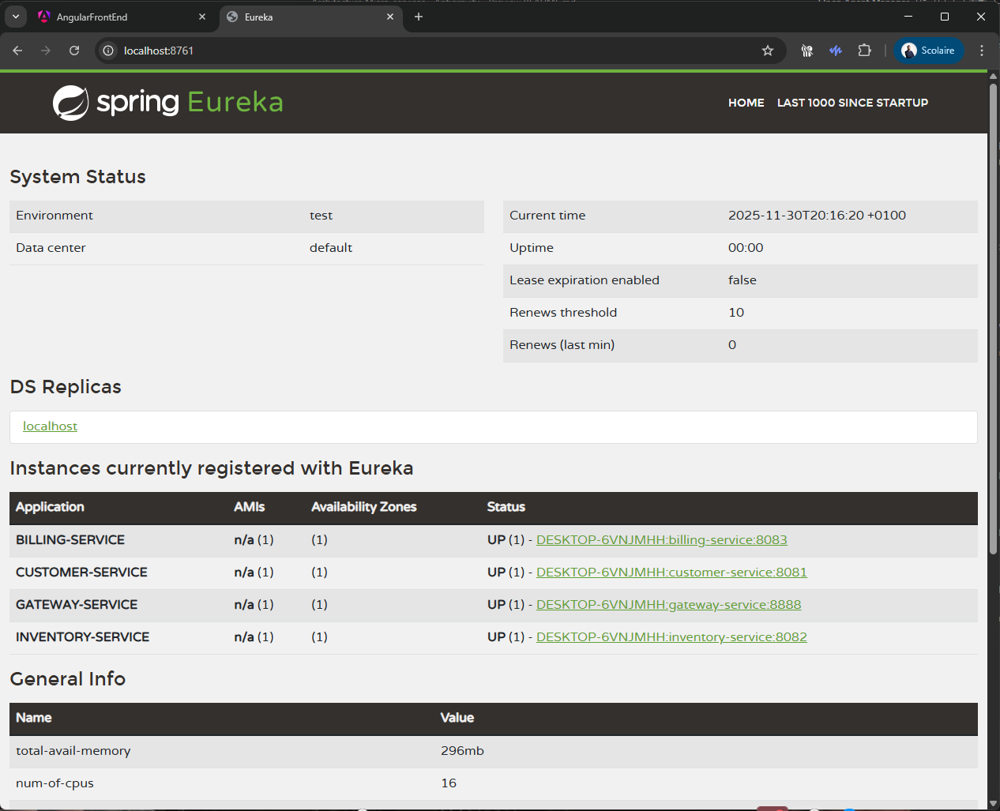
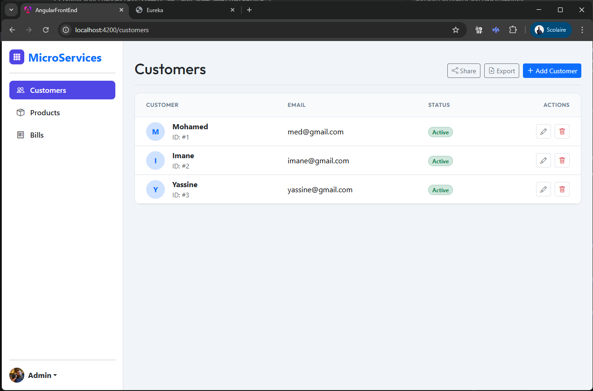
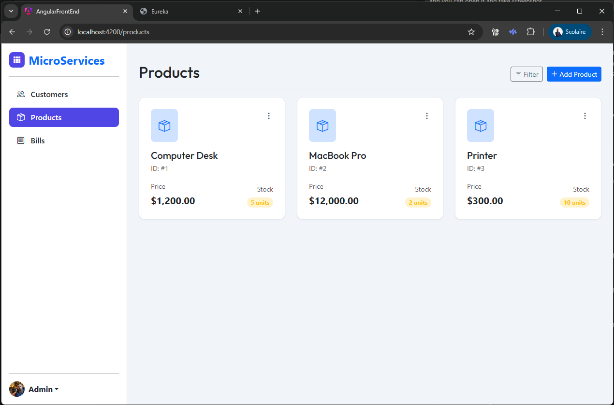
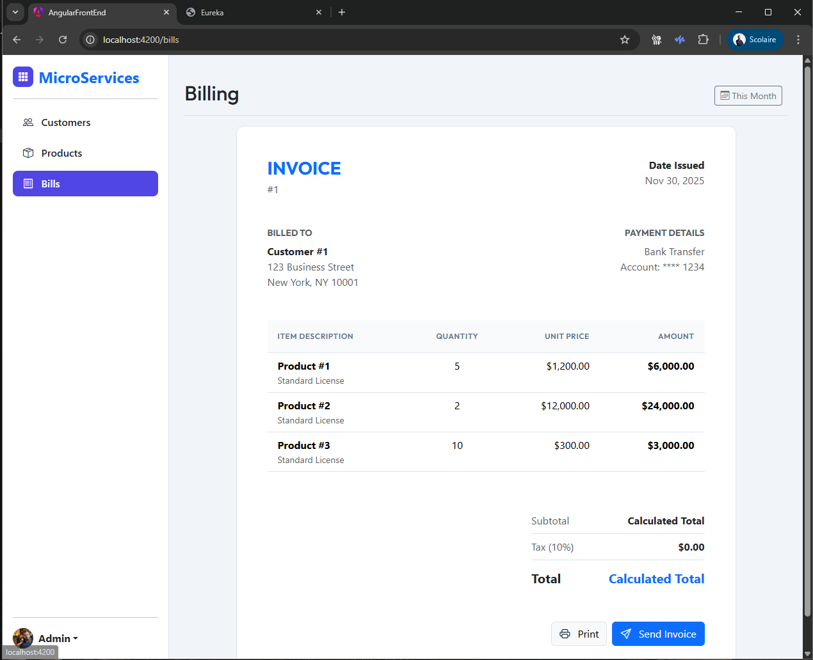

# Microservices Architecture Project

A robust and scalable microservices application designed for managing customers, inventory, and billing operations. Built with **Spring Boot** and **Angular**, featuring a modern, responsive dashboard.

## 🚀 Project Overview

This project demonstrates a distributed system architecture where each core domain is handled by a dedicated microservice. The services communicate via REST APIs and are orchestrated through a central API Gateway.

### Key Features
- **Microservices Architecture**: Decoupled services for scalability and maintainability.
- **Centralized Configuration**: Managed via Spring Cloud Config.
- **Service Discovery**: Dynamic service registration with Eureka.
- **API Gateway**: Single entry point for routing and load balancing.
- **Modern Frontend**: Angular-based SPA with a professional dashboard design.
- **Responsive UI**: Built with Bootstrap 5 and custom glassmorphism/card styles.

## 🛠️ Technology Stack

### Backend
- **Java 17**
- **Spring Boot 3.x**
- **Spring Cloud** (Gateway, Netflix Eureka, Config)
- **Spring Data JPA**
- **H2 Database** (In-Memory for Development)
- **Lombok**
- **Maven**

### Frontend
- **Angular 18+**
- **TypeScript**
- **Bootstrap 5**
- **Bootstrap Icons**
- **RxJS**

## 🏗️ Architecture

The system consists of the following components:


*Service Registry (Eureka) showing all active microservices.*

| Service | Port | Description |
| :--- | :--- | :--- |
| **Config Service** | `8888` | Centralized configuration server. |
| **Discovery Service** | `8761` | Eureka server for service registry. |
| **Gateway Service** | `8888` | API Gateway (proxies requests to internal services). |
| **Customer Service** | `8081` | Manages customer data. |
| **Inventory Service** | `8082` | Manages products and stock levels. |
| **Billing Service** | `8083` | Handles invoicing and billing operations. |
| **Angular Frontend** | `4200` | User interface for the application. |

## ⚙️ Setup & Installation

### Prerequisites
- **Java JDK 17+**
- **Maven 3.8+**
- **Node.js 18+** & **npm**
- **Angular CLI** (`npm install -g @angular/cli`)

### 1. Clone the Repository
```bash
git clone <repository-url>
cd <project-directory>
```

### 2. Start Backend Services
Start the services in the following order to ensure dependencies are met:

1.  **Config Service**
2.  **Discovery Service**
3.  **Gateway Service**
4.  **Customer Service**
5.  **Inventory Service**
6.  **Billing Service**

For each service, navigate to its directory and run:
```bash
mvn spring-boot:run
```

### 3. Start Frontend Application
Navigate to the Angular project directory:
```bash
cd angular-front-end
```

Install dependencies (first time only):
```bash
npm install
```

Start the development server:
```bash
npm start
```

Access the application at `http://localhost:4200`.

## 🖥️ Frontend Dashboard

The frontend features a **Modern Dashboard** layout with:
- **Sidebar Navigation**: Easy access to Customers, Products, and Bills.
- **Clean UI**: Light theme with professional typography and card-based layouts.

### Customers Management

*View and manage customers with status badges.*

### Inventory Management

*Visual inventory management with stock indicators.*

### Billing & Invoices

*Detailed invoice layout with print/download options.*

## 🤝 Contributing

1.  Fork the repository.
2.  Create your feature branch (`git checkout -b feature/AmazingFeature`).
3.  Commit your changes (`git commit -m 'Add some AmazingFeature'`).
4.  Push to the branch (`git push origin feature/AmazingFeature`).
5.  Open a Pull Request.

---
*Developed for Master M2 - II-BDCC - Ingénierie Informatique, Big Data et Cloud Computing*
